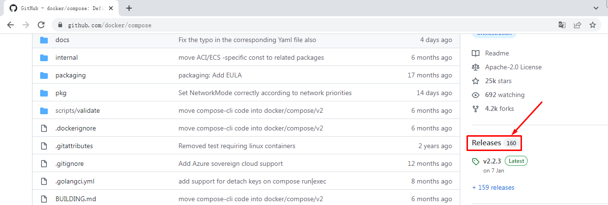
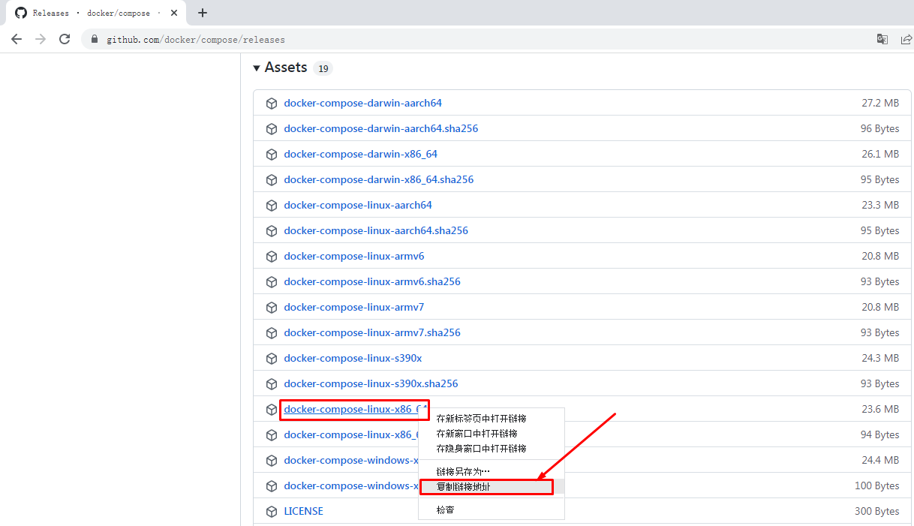

# Docker容器服务编排利器 Docker Compose应用实战

# 一、使用Docker Compose必要性及定义

用容器运行一个服务,需要使用`docker run`命令。但如果我要运行多个服务呢?

假设我要运行一个web服务,还要运行一个db服务,那么是用一个容器运行,还是用多个容器运行呢?

一个容器运行多个服务会造成镜像的复杂度提高,**Docker倾向于一个容器运行一个应用**。

那么复杂的架构就会需要很多的容器,并且需要它们之间有关联(容器之间的依赖和连接)就更复杂了。

这个复杂的问题需要解决,这就涉及到了**容器编排**的问题了。

- Compose
  - 编排
    - 是对多个容器进行启动和管理的方法
    - 例如：LNMT，先启动MySQL,再启动Tomcat，最后启动Nginx
- 服务架构的演进
  - 单体服务架构
  - 分布式服务架构
  - 微服务架构
  - 超微服务架构
- 容器编排工具
  - docker machine
    - 在虚拟机中部署docker容器引擎的工具
  - docker compose
    - 是一个用于定义和运行多容器Docker的应用程序工具
  - docker swarm
    - 是Docker Host主机批量管理及资源调度管理工具
  - mesos+marathon
    - mesos 对计算机计算资源进行管理和调度
    - marathon 服务发现及负载均衡的功能
  - kubernetes
    - google开源的容器编排工具

# 二、Docker Compose应用参考资料

- 网址
  - https://docs.docker.com/compose/

- yaml格式
  - https://yaml.org/


# 三、Docker Compose应用最佳实践步骤

## 3.1 概念

- 工程（project）
- 服务 (Service)
- 容器 (Container)


## 3.2 步骤

1.定义应用的Dockerfile文件，为了anywhere进行构建。

2.使用docker-compose.yaml定义一套服务，这套服务可以一起在一个隔离环境中运行。

3.使用docker-compose up就可以启动整套服务。


# 四、Docker Compose安装








~~~shell
$ wget https://github.com/docker/compose/releases/download/v2.2.3/docker-compose-linux-x86_64

$ mv docker-compose-linux-x86_64 /usr/bin/docker-compose

$ chmod +x /usr/bin/docker-compose

$ docker-compose version
Docker Compose version v2.2.3
~~~

# 五、Docker Compose应用案例

> 运行Python语言开发的网站

## 5.1 网站文件准备

~~~shell
$ mkdir flaskproject
[root@localhost ~]$ cd flaskproject/


[root@localhost flaskproject]$ vim app.py
[root@localhost flaskproject]$ cat app.py
import time

import redis
from flask import Flask

app = Flask(__name__)
cache = redis.Redis(host='redis', port=6379)


def get_hit_count():
    retries = 5
    while True:
        try:
            return cache.incr('hits')
        except redis.exceptions.ConnectionError as exc:
            if retries == 0:
                raise exc
            retries -= 1
            time.sleep(0.5)


@app.route('/')
def hello():
    count = get_hit_count()
    return 'Hello World! I have been seen {} times.\n'.format(count)
    
    
    
[root@localhost flaskproject]$ vim requirements.txt
[root@localhost flaskproject]$ cat requirements.txt
flask
redis
~~~


## 5.2 Dockerfile文件准备

~~~shell
[root@localhost flaskproject]$ vim Dockerfile
[root@localhost flaskproject]$ cat Dockerfile
FROM python:3.7-alpine
WORKDIR /code
ENV FLASK_APP app.py
ENV FLASK_RUN_HOST 0.0.0.0
RUN apk add --no-cache gcc musl-dev linux-headers
COPY requirements.txt requirements.txt
RUN pip install -r requirements.txt
COPY . .
CMD ["flask", "run"]
~~~


## 5.3 Compose文件准备

~~~shell
[root@localhost flaskproject]$ vim docker-compose.yaml
[root@localhost flaskproject]$ cat docker-compose.yaml
version: '3'
services:
  web:
    build: .
    ports:
      - "5000:5000"
  redis:
    image: "redis:alpine"
~~~


## 5.4 使用docker-compose up启动容器

~~~shell
[root@localhost flaskproject]$ ls
app.py  docker-compose.yaml  Dockerfile  requirements.txt

[root@localhost flaskproject]# docker-compose up

~~~

## 5.5 访问


#  六、命令使用说明

## `build`

​	格式为 `docker-compose build [options] [SERVICE...]`。

​	构建（重新构建）项目中的服务容器。服务容器一旦构建后，将会带上一个标记名，例如对于 web 项目中的一个 db 容器，可能是 web_db。可以随时在项目目录下运行 `docker-compose build` 来重新构建服务。

​	选项包括：

- 

  `--force-rm` 删除构建过程中的临时容器。

- 

  `--no-cache` 构建镜像过程中不使用 cache（这将加长构建过程）。

- 

  `--pull` 始终尝试通过 pull 来获取更新版本的镜像。

## `config`

​	验证 Compose 文件格式是否正确，若正确则显示配置，若格式错误显示错误原因。

## `down`

​	此命令将会停止 `up` 命令所启动的容器，并移除网络

## `exec`

​	进入指定的容器。

## `help`

​	获得一个命令的帮助。

## `images`

​	列出 Compose 文件中包含的镜像。

## `kill`

​	格式为 `docker-compose kill [options] [SERVICE...]`。

​	通过发送 `SIGKILL` 信号来强制停止服务容器。

​	支持通过 `-s` 参数来指定发送的信号，例如通过如下指令发送 `SIGINT` 信号。

```shell
$ docker-compose kill -s SIGINT
```


## `logs`

​	格式为 `docker-compose logs [options] [SERVICE...]`。

​	查看服务容器的输出。默认情况下，docker-compose 将对不同的服务输出使用不同的颜色来区分。可以通过 `--no-color` 来关闭颜色。

​	该命令在调试问题的时候十分有用。

## `pause`

​	格式为 `docker-compose pause [SERVICE...]`。

​	暂停一个服务容器。

## `port`

​	格式为 `docker-compose port [options] SERVICE PRIVATE_PORT`。

​	打印某个容器端口所映射的公共端口。

​	选项：

- 

  `--protocol=proto` 指定端口协议，tcp（默认值）或者 udp。

- 

  `--index=index` 如果同一服务存在多个容器，指定命令对象容器的序号（默认为 1）。

## `ps`

​	格式为 `docker-compose ps [options] [SERVICE...]`。

​	列出项目中目前的所有容器。

​	选项：

- 

  `-q` 只打印容器的 ID 信息。

## `pull`

​	格式为 `docker-compose pull [options] [SERVICE...]`。

​	拉取服务依赖的镜像。

​	选项：

- 

  `--ignore-pull-failures` 忽略拉取镜像过程中的错误。

## `push`

​	推送服务依赖的镜像到 Docker 镜像仓库。

## `restart`

​	格式为 `docker-compose restart [options] [SERVICE...]`。

​	重启项目中的服务。

​	选项：

- 

  `-t, --timeout TIMEOUT` 指定重启前停止容器的超时（默认为 10 秒）。

## `rm`

​	格式为 `docker-compose rm [options] [SERVICE...]`。

​	删除所有（停止状态的）服务容器。推荐先执行 `docker-compose stop` 命令来停止容器。

​	选项：

- 

  `-f, --force` 强制直接删除，包括非停止状态的容器。一般尽量不要使用该选项。

- 

  `-v` 删除容器所挂载的数据卷。

## `run`

​	格式为 `docker-compose run [options] [-p PORT...] [-e KEY=VAL...] SERVICE [COMMAND] [ARGS...]`。

​	在指定服务上执行一个命令。

​	例如：

```shell
$ docker-compose run ubuntu ping docker.com
```

​	将会启动一个 ubuntu 服务容器，并执行 `ping docker.com` 命令。

​	默认情况下，如果存在关联，则所有关联的服务将会自动被启动，除非这些服务已经在运行中。

​	该命令类似启动容器后运行指定的命令，相关卷、链接等等都将会按照配置自动创建。

​	两个不同点：

- 

  给定命令将会覆盖原有的自动运行命令；

- 

  不会自动创建端口，以避免冲突。

如果不希望自动启动关联的容器，可以使用 `--no-deps` 选项，例如

```shell
$ docker-compose run --no-deps web python manage.py shell
```

​	将不会启动 web 容器所关联的其它容器。

​	选项：

- 

  `-d` 后台运行容器。

- 

  `--name NAME` 为容器指定一个名字。

- 

  `--entrypoint CMD` 覆盖默认的容器启动指令。

- 

  `-e KEY=VAL` 设置环境变量值，可多次使用选项来设置多个环境变量。

- 

  `-u, --user=""` 指定运行容器的用户名或者 uid。

- 

  `--no-deps` 不自动启动关联的服务容器。

- 

  `--rm` 运行命令后自动删除容器，`d` 模式下将忽略。

- 

  `-p, --publish=[]` 映射容器端口到本地主机。

- 

  `--service-ports` 配置服务端口并映射到本地主机。

- 

  `-T` 不分配伪 tty，意味着依赖 tty 的指令将无法运行。

## `scale`

​	格式为 `docker-compose scale [options] [SERVICE=NUM...]`。

​	设置指定服务运行的容器个数。

​	通过 `service=num` 的参数来设置数量。例如：

```shell
$ docker-compose scale web=3 db=2
```

​	将启动 3 个容器运行 web 服务，2 个容器运行 db 服务。

​	一般的，当指定数目多于该服务当前实际运行容器，将新创建并启动容器；反之，将停止容器。

​	选项：

- 

  `-t, --timeout TIMEOUT` 停止容器时候的超时（默认为 10 秒）。

## `start`

​	格式为 `docker-compose start [SERVICE...]`。

​	启动已经存在的服务容器。

## `stop`

​	格式为 `docker-compose stop [options] [SERVICE...]`。

​	停止已经处于运行状态的容器，但不删除它。通过 `docker-compose start` 可以再次启动这些容器。

​	选项：

- 

  `-t, --timeout TIMEOUT` 停止容器时候的超时（默认为 10 秒）。

## `top`

​	查看各个服务容器内运行的进程。

## `unpause`

​	格式为 `docker-compose unpause [SERVICE...]`。

​	恢复处于暂停状态中的服务。

## `up`

​	格式为 `docker-compose up [options] [SERVICE...]`。

​	**该命令十分强大，它将尝试自动完成包括构建镜像，（重新）创建服务，启动服务，并关联服务相关容器的一系列操作。**

​	链接的服务都将会被自动启动，除非已经处于运行状态。可以说，大部分时候都可以直接通过该命令来启动一个项目。

​	默认情况，`docker-compose up` 启动的容器都在前台，控制台将会同时打印所有容器的输出信息，可以很方便进行调试。

​	当通过 `Ctrl-C` 停止命令时，所有容器将会停止。

​	如果使用 `docker-compose up -d`，将会在后台启动并运行所有的容器。一般推荐生产环境下使用该选项。

​	默认情况，如果服务容器已经存在，`docker-compose up` 将会尝试停止容器，然后重新创建（保持使用 `volumes-from` 挂载的卷），以保证新启动的服务匹配 `docker-compose.yml` 文件的最新内容。如果用户不希望容器被停止并重新创建，可以使用 `docker-compose up --no-recreate`。这样将只会启动处于停止状态的容器，而忽略已经运行的服务。如果用户只想重新部署某个服务，可以使用 `docker-compose up --no-deps -d <SERVICE_NAME>` 来重新创建服务并后台停止旧服务，启动新服务，并不会影响到其所依赖的服务。

​	选项：

- 

  `-d` 在后台运行服务容器。

- 

  `--no-color` 不使用颜色来区分不同的服务的控制台输出。

- 

  `--no-deps` 不启动服务所链接的容器。

- 

  `--force-recreate` 强制重新创建容器，不能与 `--no-recreate` 同时使用。

- 

  `--no-recreate` 如果容器已经存在了，则不重新创建，不能与 `--force-recreate` 同时使用。

- 

  `--no-build` 不自动构建缺失的服务镜像。

- 

  `-t, --timeout TIMEOUT` 停止容器时候的超时（默认为 10 秒）。

## `version`

​	格式为 `docker-compose version`。

​	打印版本信息。


参考：[实战Docker容器调度](https://www.cnblogs.com/ZhuChangwu/p/13717405.html)

# [七、Compose 模板文件](https://yeasy.gitbook.io/docker_practice/compose/compose_file)
