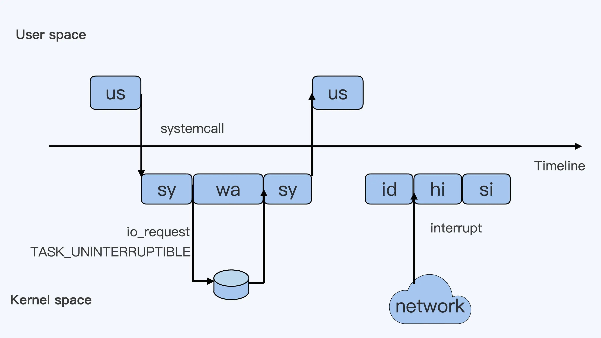
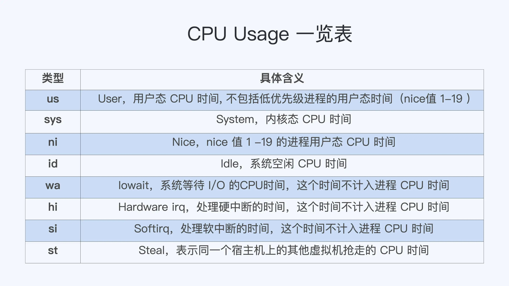
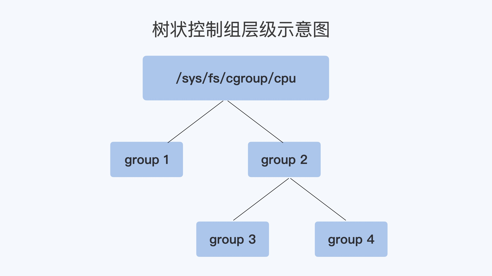

# 容器CPU（1）：怎么限制容器的CPU使用？

## 如何理解 CPU 使用和 CPU Cgroup？

​	既然我们需要理解 CPU Cgroup，那么就有必要先来看一下 Linux 里的 CPU 使用的概念，这是因为 CPU Cgroup 最大的作用就是限制 CPU 使用。

## CPU 使用的分类

​	如果你想查看 Linux 系统的 CPU 使用的话，会用什么方法呢？最常用的肯定是运行 Top 了。我们对照下图的 Top 运行界面，在截图第三行，"%Cpu(s)"开头的这一行，你会看到一串数值，也就是"0.0 us, 0.0 sy, 0.0 ni, 99.9 id, 0.0 wa, 0.0 hi, 0.0 si, 0.0 st"，那么这里的每一项值都是什么含义呢？


​	下面这张图里最长的带箭头横轴，我们可以把它看成一个时间轴。同时，它的上半部分代表 Linux 用户态（User space），下半部分代表内核态（Kernel space）。这里为了方便你理解，我们先假设只有一个 CPU 吧。



​	我们可以用上面这张图，把这些值挨个解释一下。

​	假设一个用户程序开始运行了，那么就对应着第一个"us"框，"us"是"user"的缩写，代表 Linux 的用户态 CPU Usage。普通用户程序代码中，只要不是调用系统调用（System Call），这些代码的指令消耗的 CPU 就都属于"us"。

​	当这个用户程序代码中调用了系统调用，比如说 read() 去读取一个文件，这时候这个用户进程就会从用户态切换到内核态。内核态 read() 系统调用在读到真正 disk 上的文件前，就会进行一些文件系统层的操作。那么这些代码指令的消耗就属于"sy"，这里就对应上面图里的第二个框。"sy"是 "system"的缩写，代表内核态 CPU 使用。

​	接下来，这个 read() 系统调用会向 Linux 的 Block Layer 发出一个 I/O Request，触发一个真正的磁盘读取操作。这时候，这个进程一般会被置为 TASK_UNINTERRUPTIBLE。而 Linux 会把这段时间标示成"wa"，对应图中的第三个框。"wa"是"iowait"的缩写，代表等待 I/O 的时间，这里的 I/O 是指 Disk I/O。

​	紧接着，当磁盘返回数据时，进程在内核态拿到数据，这里仍旧是内核态的 CPU 使用中的"sy"，也就是图中的第四个框。然后，进程再从内核态切换回用户态，在用户态得到文件数据，这里进程又回到用户态的 CPU 使用，"us"，对应图中第五个框。

​	好，这里我们假设一下，这个用户进程在读取数据之后，没事可做就休眠了。并且我们可以进一步假设，这时在这个 CPU 上也没有其他需要运行的进程了，那么系统就会进入"id"这个步骤，也就是第六个框。"id"是"idle"的缩写，代表系统处于空闲状态。

​	如果这时这台机器在网络收到一个网络数据包，网卡就会发出一个中断（interrupt）。相应地，CPU 会响应中断，然后进入中断服务程序。

​	这时，CPU 就会进入"hi"，也就是第七个框。"hi"是"hardware irq"的缩写，代表 CPU 处理硬中断的开销。由于我们的中断服务处理需要关闭中断，所以这个硬中断的时间不能太长。

​	但是，发生中断后的工作是必须要完成的，如果这些工作比较耗时那怎么办呢？Linux 中有一个软中断的概念（softirq），它可以完成这些耗时比较长的工作。

​	你可以这样理解这个软中断，从网卡收到数据包的大部分工作，都是通过软中断来处理的。那么，CPU 就会进入到第八个框，"si"。这里"si"是"softirq"的缩写，代表 CPU 处理软中断的开销。

​	这里你要注意，无论是"hi"还是"si"，它们的 CPU 时间都不会计入进程的 CPU 时间。**这是因为本身它们在处理的时候就不属于任何一个进程。**

​	好了，通过这个场景假设，我们介绍了大部分的 Linux CPU 使用。

​	不过，我们还剩两个类型的 CPU 使用没讲到，我想给你做个补充，一次性带你做个全面了解。这样以后你解决相关问题时，就不会再犹豫，这些值到底影不影响 CPU Cgroup 中的限制了。

​	下面我给你具体讲一下。一个是"ni"，是"nice"的缩写，这里表示如果进程的 nice 值是正值（1-19），代表优先级比较低的进程运行时所占用的 CPU。另外一个是"st"，"st"是"steal"的缩写，是在虚拟机里用的一个 CPU 使用类型，表示有多少时间是被同一个宿主机上的其他虚拟机抢走的。综合前面的内容，我再用表格为你总结一下：



## CPU Cgroup

​	我们提到过 Cgroups 是对指定进程做计算机资源限制的，CPU Cgroup 是 Cgroups 其中的一个 Cgroups 子系统，它是用来限制进程的 CPU 使用的。对于进程的 CPU 使用, 通过前面的 Linux CPU 使用分类的介绍，我们知道它只包含两部分: **一个是用户态，这里的用户态包含了 us 和 ni；还有一部分是内核态，也就是 sy。**至于 wa、hi、si，这些 I/O 或者中断相关的 CPU 使用，CPU Cgroup 不会去做限制，那么接下来我们就来看看 CPU Cgoup 是怎么工作的？

​	每个 Cgroups 子系统都是通过一个虚拟文件系统挂载点的方式，挂到一个缺省的目录下，CPU Cgroup 一般在 Linux 发行版里会放在 /sys/fs/cgroup/cpu 这个目录下。在这个子系统的目录下，每个控制组（Control Group） 都是一个子目录，各个控制组之间的关系就是一个树状的层级关系（hierarchy）。比如说，我们在子系统的最顶层开始建立两个控制组（也就是建立两个目录）group1 和 group2，然后再在 group2 的下面再建立两个控制组 group3 和 group4。这样操作以后，我们就建立了一个树状的控制组层级，你可以参考下面的示意图。



​	那么我们的每个控制组里，都有哪些 CPU Cgroup 相关的控制信息呢？这里我们需要看一下每个控制组目录中的内容：

```shell
# pwd
/sys/fs/cgroup/cpu
# mkdir group1 group2
# cd group2
# mkdir group3 group4
# cd group3
# ls cpu.*
cpu.cfs_period_us  cpu.cfs_quota_us  cpu.rt_period_us  cpu.rt_runtime_us  cpu.shares  cpu.stat 
```

​	考虑到在云平台里呢，大部分程序都不是实时调度的进程，而是普通调度（SCHED_NORMAL）类型进程，那什么是普通调度类型呢？

​	因为普通调度的算法在 Linux 中目前是 CFS （Completely Fair Scheduler，即完全公平调度器）。为了方便你理解，我们就直接来看 CPU Cgroup 和 CFS 相关的参数，一共有三个。

​	第一个参数是 **cpu.cfs_period_us**，它是 CFS 算法的一个调度周期，一般它的值是 100000，以 microseconds 为单位，也就 100ms。

​	第二个参数是 **cpu.cfs_quota_us**，它“表示 CFS 算法中，在一个调度周期里这个控制组被允许的运行时间，比如这个值为 50000 时，就是 50ms。如果用这个值去除以调度周期（也就是 cpu.cfs_period_us），50ms/100ms = 0.5，这样这个控制组被允许使用的 CPU 最大配额就是 0.5 个 CPU。从这里能够看出，cpu.cfs_quota_us 是一个绝对值。如果这个值是 200000，也就是 200ms，那么它除以 period，也就是 200ms/100ms=2。你看，结果超过了 1 个 CPU，这就意味着这时控制组需要 2 个 CPU 的资源配额。

​	我们再来看看第三个参数， **cpu.shares**。这个值是 CPU Cgroup 对于控制组之间的 CPU 分配比例，它的缺省值是 1024。假设我们前面创建的 group3 中的 cpu.shares 是 1024，而 group4 中的 cpu.shares 是 3072，那么 group3:group4=1:3。

​	这个比例是什么意思呢？我还是举个具体的例子来说明吧。在一台 4 个 CPU 的机器上，当 group3 和 group4 都需要 4 个 CPU 的时候，它们实际分配到的 CPU 分别是这样的：group3 是 1 个，group4 是 3 个。

​	我们刚才讲了 CPU Cgroup 里的三个关键参数，接下来我们就通过几个例子来进一步理解一下，[代码](./cgroup_cpu)你可以在这里找到。

​	第一个例子，我们启动一个消耗 2 个 CPU（200%）的程序 threads-cpu，然后把这个程序的 pid 加入到 group3 的控制组里：

```shell
./threads-cpu/threads-cpu 2 &
echo $! > /sys/fs/cgroup/cpu/group2/group3/cgroup.procs 
```

​	在我们没有修改 cpu.cfs_quota_us 前，用 top 命令可以看到 threads-cpu 这个进程的 CPU 使用是 199%，近似 2 个 CPU。


​	然后，我们更新这个控制组里的 cpu.cfs_quota_us，把它设置为 150000（150ms）。把这个值除以 cpu.cfs_period_us，计算过程是 150ms/100ms=1.5, 也就是 1.5 个 CPU，同时我们也把 cpu.shares 设置为 1024。

```shell
echo 150000 >/sys/fs/cgroup/cpu/group2/group3/cpu.cfs_quota_us
echo 1024 > /sys/fs/cgroup/cpu/group2/group3/cpu.shares
```

​	这时候我们再运行 top，就会发现 threads-cpu 进程的 CPU 使用减小到了 150%。这是因为我们设置的 cpu.cfs_quota_us 起了作用，限制了进程 CPU 的绝对值。但这时候 cpu.shares 的作用还没有发挥出来，**因为 cpu.shares 是几个控制组之间的 CPU 分配比例，而且一定要到整个节点中所有的 CPU 都跑满的时候，它才能发挥作用。**


​	好，下面我们再来运行第二个例子来理解 cpu.shares。我们先把第一个例子里的程序启动，同时按前面的内容，一步步设置好 group3 里 cpu.cfs_quota_us 和 cpu.shares。

​	设置完成后，我们再启动第二个程序，并且设置好 group4 里的 cpu.cfs_quota_us 和 cpu.shares。

​	group3：

```shell
./threads-cpu/threads-cpu 2 &  # 启动一个消耗2个CPU的程序
echo $! > /sys/fs/cgroup/cpu/group2/group3/cgroup.procs #把程序的pid加入到控制组
echo 150000 >/sys/fs/cgroup/cpu/group2/group3/cpu.cfs_quota_us #限制CPU为1.5CPU
echo 1024 > /sys/fs/cgroup/cpu/group2/group3/cpu.shares 

```

​	group4：

```shell
./threads-cpu/threads-cpu 4 &  # 启动一个消耗4个CPU的程序
echo $! > /sys/fs/cgroup/cpu/group2/group4/cgroup.procs #把程序的pid加入到控制组
echo 350000 >/sys/fs/cgroup/cpu/group2/group4/cpu.cfs_quota_us  #限制CPU为3.5CPU
echo 3072 > /sys/fs/cgroup/cpu/group2/group4/cpu.shares # shares 比例 group4: group3 = 3:1
```

​	好了，现在我们的节点上总共有 4 个 CPU，而 group3 的程序需要消耗 2 个 CPU，group4 里的程序要消耗 4 个 CPU。

​	即使 cpu.cfs_quota_us 已经限制了进程 CPU 使用的绝对值，group3 的限制是 1.5CPU，group4 是 3.5CPU，1.5+3.5=5，这个结果还是超过了节点上的 4 个 CPU。好了，说到这里，我们发现在这种情况下，cpu.shares 终于开始起作用了。

​	在这里 shares 比例是 group4:group3=3:1，在总共 4 个 CPU 的节点上，按照比例，group4 里的进程应该分配到 3 个 CPU，而 group3 里的进程会分配到 1 个 CPU。我们用 top 可以看一下，结果和我们预期的一样。


​	好了，我们对 CPU Cgroup 的参数做一个梳理。

​	第一点，cpu.cfs_quota_us 和 cpu.cfs_period_us 这两个值**决定了每个控制组中所有进程的可使用 CPU 资源的最大值。**

​	第二点，cpu.shares 这个值决定了 **CPU Cgroup 子系统下控制组可用 CPU 的相对比例**，不过只有当系统上 CPU 完全被占满的时候，这个比例才会在各个控制组间起作用。

## 现象解释

​	在解释了 Linux CPU Usage 和 CPU Cgroup 这两个基本概念之后，我们再回到我们最初的问题 “怎么限制容器的 CPU 使用”。有了基础知识的铺垫，这个问题就比较好解释了。

​	首先，Kubernetes 会为每个容器都在 CPUCgroup 的子系统中建立一个控制组，然后把容器中进程写入到这个控制组里。

```yaml
apiVersion: v1
kind: Pod
metadata:
  name: frontend
spec:
  containers:
  - name: app
    image: images.my-company.example/app:v4
    env:
    resources:
      requests:
        memory: "64Mi"
        cpu: "1"
      limits:
        memory: "128Mi"
        cpu: "2"
…
```

​	这时候"Limit CPU"就需要为容器设置可用 CPU 的上限。结合前面我们讲的几个参数么，我们就能知道容器的 CPU 上限具体如何计算了。

​	容器 CPU 的上限由 cpu.cfs_quota_us 除以 cpu.cfs_period_us 得出的值来决定的。而且，在操作系统里，cpu.cfs_period_us 的值一般是个固定值，Kubernetes 不会去修改它，所以我们就是只修改 cpu.cfs_quota_us。

​	而"Request CPU"就是无论其他容器申请多少 CPU 资源，即使运行时整个节点的 CPU 都被占满的情况下，我的这个容器还是可以保证获得需要的 CPU 数目，那么这个设置具体要怎么实现呢？

​	显然我们需要设置 cpu.shares 这个参数：**在 CPU Cgroup 中 cpu.shares == 1024 表示 1 个 CPU 的比例，那么 Request CPU 的值就是 n，给 cpu.shares 的赋值对应就是 n*1024。**

## 重点总结

​	首先，我带你了解了 Linux 下 CPU Usage 的种类。

​	这里你要注意的是**每个进程的 CPU Usage 只包含用户态（us 或 ni）和内核态（sy）两部分，其他的系统 CPU 开销并不包含在进程的 CPU 使用中，而 CPU Cgroup 只是对进程的 CPU 使用做了限制。**

​	其实这一讲我们开篇的问题“怎么限制容器的 CPU 使用”，这个问题背后隐藏了另一个问题，也就是容器是如何设置它的 CPU Cgroup 中参数值的？想解决这个问题，就要先知道 CPU Cgroup 都有哪些参数。

​	所以，我详细给你介绍了 CPU Cgroup 中的主要参数，包括这三个：**cpu.cfs_quota_us，cpu.cfs_period_us 还有 cpu.shares。**

​	其中，cpu.cfs_quota_us（一个调度周期里这个控制组被允许的运行时间）除以 cpu.cfs_period_us（用于设置调度周期）得到的这个值决定了 CPU Cgroup 每个控制组中 CPU 使用的上限值。你还需要掌握一个 cpu.shares 参数，正是这个值决定了 CPU Cgroup 子系统下控制组可用 CPU 的相对比例，当系统上 CPU 完全被占满的时候，这个比例才会在各个控制组间起效。

​	最后，我们明白了 CPU Cgroup 关键参数是什么含义后，Kubernetes 中"Limit CPU"和 "Request CPU"也就很好解释了: **Limit CPU 就是容器所在 Cgroup 控制组中的 CPU 上限值，Request CPU 的值就是控制组中的 cpu.shares 的值。**


## 思考题

- 我们还是按照文档中定义的控制组目录层次结构图，然后按序执行这几个脚本：1、create_groups.sh   2、update_group1.sh                               3、update_group4.sh   4、update_group3.sh

  那么，在一个 4 个 CPU 的节点上，group1/group3/group4 里的进程，分别会被分配到多少 CPU 呢?
  
  答：分别为2,1.5,0.5 group1和group2分配的cpu配额已经超过4个总cpu，那么就会按照cpu.shares的比例去分配cpu。其中，group1:group2=1:1，group3:group4=1:3，group2=group3+group4，得出group1:group3:group4=4:1:3
  
  
  
- 为什么说“云平台里呢，大部分程序都不是实时调度的进程，而是普通调度（SCHED_NORMAL）类型进程”？

  答：进程如果设置为SCHED_FIFO 或者SCHED_RR实时调度类型，那么只要进程任务不结束，就不会把cpu资源让给SCHED_NORMAL进程。这种实时的进程，在实时性要比较高的嵌入式系统中会用到，但是云平台中提供互联网服务的应用中不太会去用实时调度。

-  假如我有10个节点，每个节点的cpu核心数是40，只是调度pod，那么limit.cpu 可以设置为400吧？

  答：一个pod只能在一个节点上运行，如果一个节点上的cpu是40， 那么limit.cpu最大只能是40

- cpu.rt_runtime_us一般是不是用不上，Linux系统中哪些程序会被配置为实时调度程序呢？如果没有实时调度程序这个参数也就没有了存在的必要吧

  答：一些嵌入式实时的程序需要实时调度的

- 关于request cpu还是不太理解 request是必须满足的 但是通过cpu.share无法保证 那k8s是如何保证的？是scheduler在调度的时候自己计算的吗 包括允许超售的情况，能否解释一下

  答：对的，在kube-scheduler里来保证request cpu, 而cpu.share是在cgroup这一层面的了，只有通过了kube-scheduler才会配置到 cgroup cpu.share.